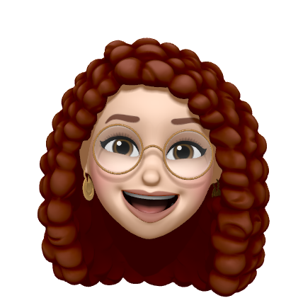
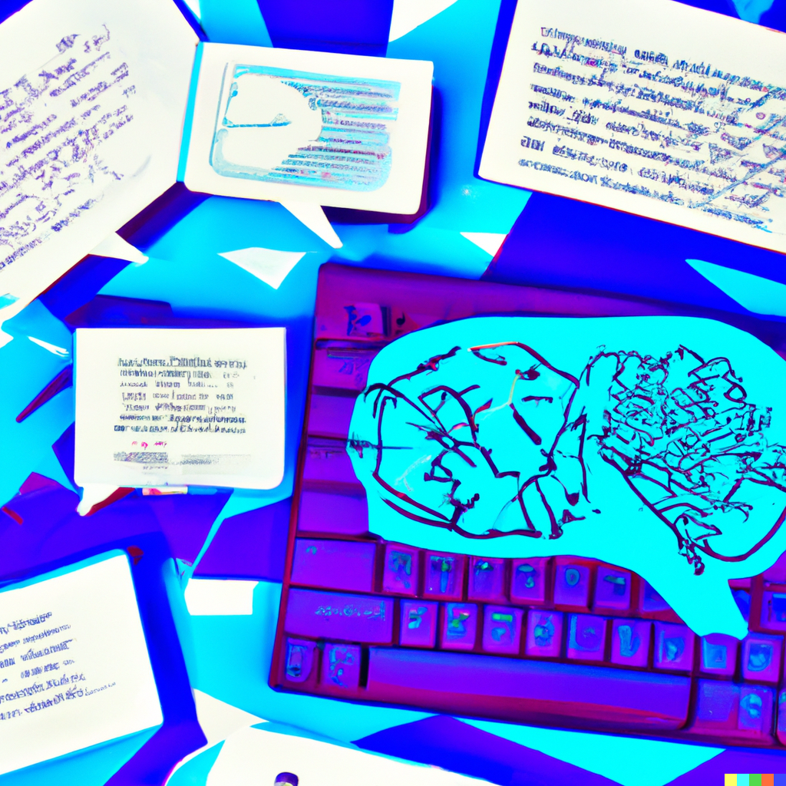

<p>&nbsp;</p>

```{r, message=FALSE, warning=FALSE, echo=FALSE}
# Set R chunk default options:
# -do not output all R messages in html report
# -do not output all R warnings in html report
# -set default figure widths and heights for all code blocks, unless you 
#  override them
knitr::opts_chunk$set(
  message = FALSE, warning = FALSE, fig.width = 16/2, fig.height = 9/2
)
```


```{r, echo = FALSE}
#loading libraries
library(ggplot2)
library(lubridate)
library(tidyr)
library(readr)
library(mapview)
library(tidyverse)
library(sf)
library(htmltools)
library(geojsonio)
library(leaflet)
library(USAboundaries)
library(maps)
library(editData)
library(sp)
library(tmaptools)
library(raster)
library(dplyr)
library(mapview)
library(readr)
```


```{r, echo=FALSE, out.width='45%', fig.align='center'}

```

<p style="text-align: center;">To read my articles, check out my <a href="https://medium.com/@elenipartakki">blog</a></p>

# **About Me**
Hey there stranger! I am a young engineer, political theorist and aspiring scientist with a passion for using technology and human-centered design to solve real-world problems. 

I grew up fascinated by the power of the human mind and machines, and how they can be used to improve our lives. This led me to pursue a dual degree in computer science and political science, where I gained a deep understanding of the principles that govern the design and operation of mechanical, electrical, and software systems, and human systems.

Since graduating, I have been fortunate enough to work on a variety of exciting projects that have allowed me to apply my skills and knowledge in a practical setting. Whether it's designing new products, optimizing manufacturing processes, or developing software applications, I am always looking for ways to use my expertise to make a positive impact.

One of the things that I love most about engineering is the way it challenges me to think creatively and analytically. Every problem is unique, and finding a solution often requires a combination of technical know-how, critical thinking, and collaboration with others. This keeps me engaged and motivated, and I am always eager to tackle new challenges.

When I'm not working, you can usually find me tinkering with gadgets and electronics, studying on new government and economic changes across the globe, reading up on the latest industry trends and technologies, exploring the great outdoors, reading about the human brain or people watching. I believe that a well-rounded life is key to achieving success and happiness, and I try to balance my work and personal interests accordingly.

I hope this website serves as an opportunity for you to explore a little more about me.
<p>&nbsp;</p>
<p>&nbsp;</p>

<p align="center">
  
</p>
<center>DALL·E prompt: Creative brain dump that inspired the creation of a new blog for the future of humanity</center>

<p>&nbsp;</p>
<p>&nbsp;</p>

# **How did I end up here?**
I grew up on the island of Cyprus, in Nicosia, the last divided capital in the world. As the daughter of a farmer and grocery store worker during climate instability and droughts, making ends meet was not always easy for my family. I recall helping my mom in the kitchens when I was only five to ensure that perhaps the people we were delivering coffee and sandwiches to would leave a few extra cents behind.

Widely known as the "tractor" of the neighborhood for breaking things and being very active (perhaps too active for some people in a patriarchal society as a girl playing sports and getting dirt everywhere), I was always supported by my family to be curious and resourceful.

At around the age of 6, I was fortunate to be passed down a computer, and my world changed. I began watching YouTube videos, learning how the internet worked, and began discovering the world of science. Simultaneously, I was very active in my community, including politics. Growing up next to so many soldiers seemed bizarre, particularly after realizing through my internet searches that maybe the rest of the world did not live like that. I began advocating for a peaceful resolution in Cyprus, and before I knew it, I was involved with the European Union and United Nations representing the youth.

Things began getting worse financially, and both my parents had faced health issues after years of trauma from experiencing war and poverty when they were kids. To help us out, I began working after school at a little tavern called "Palm Tree" (Finija in Cypriot), and then when I'd ride my bike back home at around midnight, I would sit and study for the next day. The positive side from this time period was that I used to have to cook for my sister and I, and as a result, I consider myself a decent cook and baker. Happy to share some recipes but HEY, keep them safe. You never know when I'll start "Eleni's Dishes", the restaurant of everything and anything... 

I was determined to make a better life for myself and my loved ones, so I worked relentlessly and became the first person in my family to go to college, receiving a full scholarship at Smith College to study Computer Science and Political Science. This was one of the largest blessings of my life. I joke that I was the first in my family to start saving money, and have a credit card, and talk about money, and as sad as it may be at times, it is what it is. 

I've always been curious about the world and wanted to make a positive impact. Of course this is a lighthearted highlight of my early years on earth, but I hope my story inspires you to pursue your dreams, no matter where you come from or how much money you have. Determination and hard work are irreplaceable my friend.
 
# **What is on my mind today?**
Currently, I am an independent researcher with one of my passions being artificial intelligence alignment. I have become fascinated with the potential of AI to revolutionize society and improve human lives. However, I also recognize the significant risks posed by powerful AI systems that could act against human interests. I am choosing to devote my free-time (free as in time I am not working to pay my bills) on research to the development of AI alignment techniques and strategies. I am conducting different independent research on topics such as value alignment, reward engineering, and cooperative AI, with a focus on ensuring that AI systems are aligned with human values and goals. As both a political science and computer science aspiring scientist, figuring out how to connect humanity and AI is of outmost importance to me, and have decided that not offering my time to aid the improvement of society, would be a life unfulfilling to me and the people I love and care about.

<p align="center">
  
</p>

&nbsp;
<hr />
<p style="text-align: center;">Portfolio by <a href="https://github.com/epartakki/">Eleni Partakki</a></p>
<p style="text-align: center;"><span style="color: #808080;"><em>elenipartakki at gmail dot com</em></span></p>

<!-- Add icon library -->
<link rel="stylesheet" href="https://cdnjs.cloudflare.com/ajax/libs/font-awesome/4.7.0/css/font-awesome.min.css">


<!-- Add font awesome icons -->
<p style="text-align: center;">
    <a href="https://twitter.com/epartakki" class="fa fa-twitter"></a>
    <a href="https://www.linkedin.com/in/elenipartakki/" class="fa fa-linkedin"></a>
    <a href="https://github.com/epartakki" class="fa fa-github"></a>
    <a href="https://medium.com/@elenipartakki" class="fa fa-medium"></a>
</p>

&nbsp;
