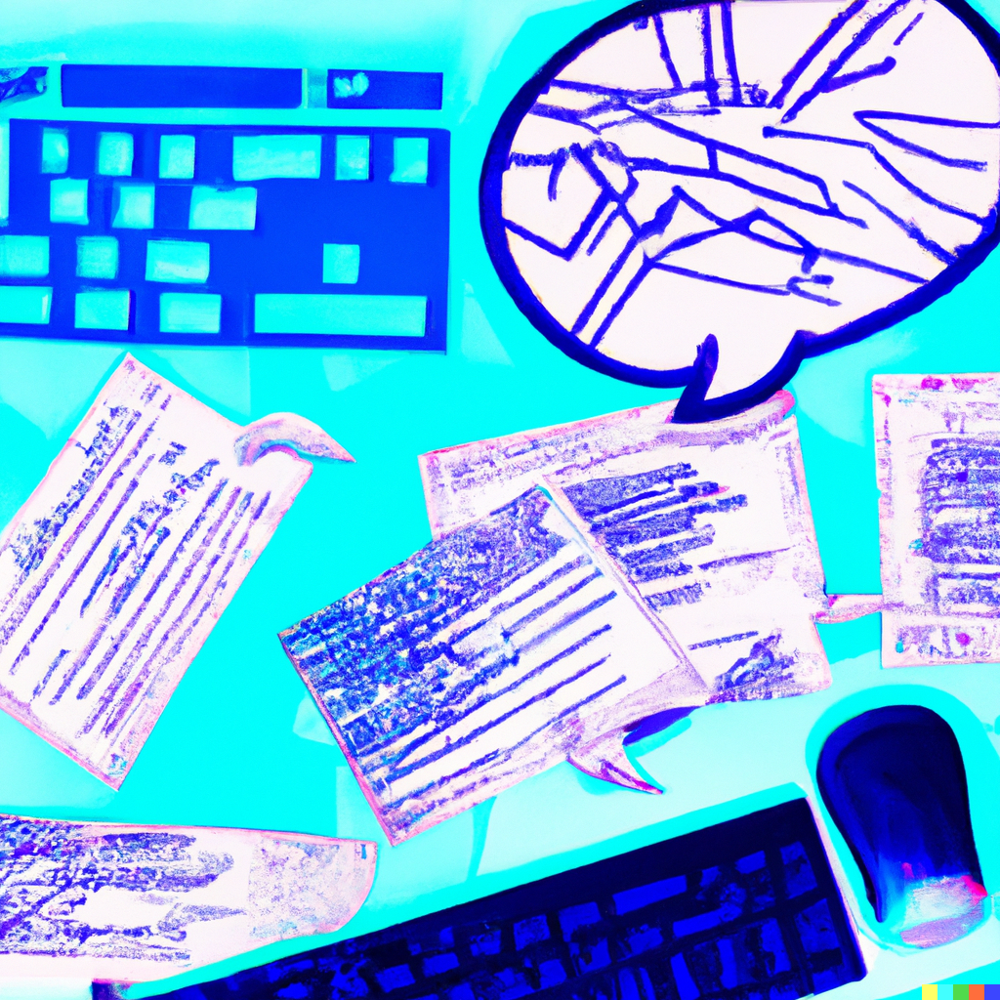

```{r, message=FALSE, warning=FALSE, echo=FALSE}
# Set R chunk default options:
# -do not output all R messages in html report
# -do not output all R warnings in html report
# -set default figure widths and heights for all code blocks, unless you 
#  override them
knitr::opts_chunk$set(
  message = FALSE, warning = FALSE, fig.width = 16/2, fig.height = 9/2
)
```
```{r, echo = FALSE}
#loading libraries

library(ggplot2)
library(lubridate)
library(tidyr)
library(readr)
library(mapview)
library(tidyverse)
library(sf)
library(htmltools)
library(geojsonio)
library(leaflet)
library(maps)
library(editData)
library(sp)
library(tmaptools)
library(dplyr)
library(mapview)
library(readr)
```

*This section is Under Development*
<p>&nbsp;</p>

## Software Engineering

Why is software engineering challenging?
Human communication is messy and planning for the uncertain is never precise.

It is also hard to think far enough for an implementation to be effective. I find that it is much easier to think in the extreme near, or the extreme far future. But what is we were better at distilling the product/tool essence of what we are trying to accomplish?

Returning to the previous idea of thinking deeply, what if we were to ask:

* Who is it for?
* What does it do?
* Why should they use it?

Perhaps this is where we tap into PM territory, but I genuinely believe that being a great engineer means being a PM of your life such that you can always accomplish tasks under the three pillars of: Business Goals, Tech Needs and User Desires.

I will explain this: presume you want to create an application that helps you split the bill between you and your friends. This could be rent, electricity; some type of repetitive monthly expense. 

Business Goal: efficiently request money while keeping a backlog
Tech Needs: needs to be accessible by everyone involved and should accurately split the bills, hence a hope for 100//2 == 50 instead of some arbitrary, or perhaps even sneaky incorrect solution.
User Desires: you want it to be pretty. You want it to not be glitchy.

Now, this leads to my next favorite thing:

### Hand Sketches.

Pencil in hand, pencil on paper. A beauty of all sorts. Wireframes and various prototypes are cool, but nothing beats the creativity of letting your hand muscles dance to the signals of your brain. I'll share some of my art later that was an aftermath of hand on paper.

### Managing and Planning

Retrospective: review the recent past to make a plan for your near future.

Building good teams requires harnessing our most human of skills. Thinking deeply.

Good thing. Bad thing. Better thing.

* What successes did you have? What went well? 
* What was frustrating? What went poorly?
* What could we do in response?


### Why I love MVP (minimum viable products) so much

I think. Constantly. Non stop. I observe people, motions and emotions around me all the time. I have many ideas, some of them better than others, and some so bad that I self-ridicule myself. Now, if I was to take all these ideas and implement them to the best of my ability, it would be such a waste of time. Some thoughts are just passing, but sometimes the itch to try something new stays a little longer. The beauty of aiming for a minimum viable product is that I can test something, fail (sometimes more, sometimes less), and decide whether this is even something I am interested enough to continue pursuing.

MVP also further supports a growth mindset instead of a stagnant obsession with perfection which we may never see. Because we always want to improve and better. It is in human nature to try to evolve. Alright alright alright we can philosophically discuss this further and I can create a counter-argument for myself, but for the sake of sharing how much I love minimum viable products, let this be.

### Developing Software
While there are many ways of developing software, the Agile Manifesto is a definite favorite.

The idea is that while there is value in the items on the right, the authors (and as a fan, myself) value the items on the left more.

[Agile Manifesto](https://agilemanifesto.org/history.html)

* *Individuals and interactions* over processes and tools
* *Working software* over comprehensive documentation
* *Customer collaboration* over contract negotiation
* *Responding to change* over following a plan

<p align="center">
  
</p>
<center>DALL·E image</center>

<p>&nbsp;</p>
<p>&nbsp;</p>

### Comparative Politics

Comparative politics is a subfield of political science that involves the systematic study and comparison of different political systems and processes across different countries or regions. It aims to identify similarities and differences in political institutions, actors, and policies, as well as the causes and consequences of these similarities and differences. Comparative politics scholars use a range of qualitative and quantitative research methods to analyze topics such as democracy, authoritarianism, state-society relations, political parties, and public policy. By examining how different political systems function and interact with each other, comparative politics helps us to better understand the complexities of politics and governance in a globalized world.

My love for comparative politics developed when I began pondering on how Cyprus could resolve its conflict. I am a deep believer in creativity, though I do not believe we have to reinvent the wheel every time we want to do something. Examining governments across the globe has not only allowed me to envision new ways of designing societies, but has also taught me a lot about myself.

Countries I have primarily focused on have been:

* United States
* Sweden
* Rwanda
* Democratic Republic of the Congo
* Cyprus
* China
* Pakistan
* Turkey

<p>&nbsp;</p>
<p>&nbsp;</p>

## Leadership

From around the age of 14, I began giving talks on conflict mediation and resolution, peace-building, and tolerance which proved to be an effective way to begin fruitful engagements and thoughtful discussions with various audiences. These talks have helped increase awareness and understanding of the root causes of conflict and ways to promote peace and tolerance.

As a speaker on these topics, I find it critical to continuously deepen my knowledge and understanding of the principles of conflict resolution and peace-building. Effective communication skills, empathy, and active listening are also essential to engage the audience and foster an open dialogue, and it is a lifelong set of skills to work on.

I have been trained and have workeded closely with Roar Thun Wægger, who runs the [Wægger Negotiation Institute (WNI)](https://wni.as/en/about-us/), after our paths had crossed during my visit to Norway with [PeacePlayers](https://peaceplayers.org/).

I have given talks for the United Nations, the European Parliament, Friends Forever International, PeacePlayers, Cyprus Friendship Program, Local Municipalities and for various other organizations worldwide, though I believe the most effective interactions I have are on a smaller scale, via more intimate interactions with humans.


You can find some press on this here:

* [European Parliament - Glimpse around 1:21](https://www.youtube.com/watch?v=VCZkTYPJC3Y&ab_channel=Parlementeurop%C3%A9enStrasbourg-Euroscola)
* [Smith College](https://www.youtube.com/watch?v=tYnTj6l8mTc&t=60s&ab_channel=SmithCollege)
* [United Nations - UNFICYP](https://unficyp.unmissions.org/sites/default/files/bb-veterans.pdf)
* [Press for UN talk](https://www.parikiaki.com/2015/09/supporting-a-cyprus-settlement-remains-priority-says-unficyps-force-commander/)
* [Friends Forever International](https://www.facebook.com/events/702743973476539/)
* [UN Essay Competition Award](https://unficyp.unmissions.org/sites/default/files/bb-peaceplayers_0.pdf)
* [Cypriot Press](https://www.ant1live.com/arheio/256348_i-16hroni-eleni-partakki-poy-timise-tin-kypro)
* [IWC Award Winner](https://www.iwc.com/en/articles/news-and-events/basketball-for-unity.html)
* [Laureus: Sport for Good Winner](https://www.laureus.com/news/time-for-sport)


## Content for the future

Topics: Projects, Competitions, Data Science, Sales Engineering, Electronics, Hobbies, Games, Books, Cooking/Baking


&nbsp;
<hr />
<p style="text-align: center;">Portfolio by <a href="https://github.com/epartakki/">Eleni Partakki</a></p>
<p style="text-align: center;"><span style="color: #808080;"><em>elenipartakki at gmail dot com</em></span></p>

<!-- Add icon library -->
<link rel="stylesheet" href="https://cdnjs.cloudflare.com/ajax/libs/font-awesome/4.7.0/css/font-awesome.min.css">

<!-- Add font awesome icons -->
<p style="text-align: center;">
    <a href="https://twitter.com/epartakki" class="fa fa-twitter"></a>
    <a href="https://www.linkedin.com/in/elenipartakki/" class="fa fa-linkedin"></a>
    <a href="https://github.com/epartakki" class="fa fa-github"></a>
    <a href="https://medium.com/@elenipartakki" class="fa fa-medium"></a>
</p>

&nbsp;


