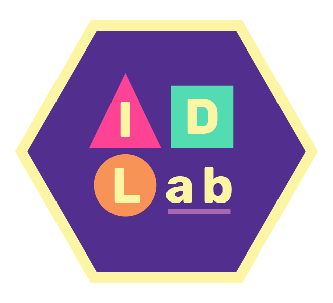

```{r, message=FALSE, warning=FALSE, echo=FALSE}
# Set R chunk default options:
# -do not output all R messages in html report
# -do not output all R warnings in html report
# -set default figure widths and heights for all code blocks, unless you 
#  override them
knitr::opts_chunk$set(
  message = FALSE, warning = FALSE, fig.width = 16/2, fig.height = 9/2
)
```
```{r, echo = FALSE}
#loading libraries

library(ggplot2)
library(lubridate)
library(tidyr)
library(readr)
library(mapview)
library(tidyverse)
library(sf)
library(htmltools)
library(geojsonio)
library(leaflet)
library(USAboundaries)
library(maps)
library(editData)
library(sp)
library(tmaptools)
library(raster)
library(dplyr)
library(mapview)
library(readr)
```

<p>&nbsp;</p>

# Independent Research on AI Alignment

Currently, I am an independent researcher with one of my passions being artificial intelligence alignment. I have become fascinated with the potential of AI to revolutionize society and improve human lives. However, I also recognize the significant risks posed by powerful AI systems that could act against human interests. I am choosing to devote my free-time (free as in time I am not working to pay my bills) on research to the development of AI alignment techniques and strategies. I am conducting different independent research on topics such as value alignment, reward engineering, and cooperative AI, with a focus on ensuring that AI systems are aligned with human values and goals. As both a political science and computer science aspiring scientist, figuring out how to connect humanity and AI is of outmost importance to me, and have decided that not offering my time to aid the improvement of society, would be a life unfulfilling to me and the people I love and care about.

I am actively communicating with various AI safety communities, and aim to utilize my blog as a way to raise public awareness in a safe and thoughtful manner. You can follow that journey on [Medium](https://medium.com/@elenipartakki).

# Inclusive Design Lab

<p align="center">
  
</p>
<center>Inclusive Design Lab (IDLab)</center>

The [Inclusive Design Lab (IDLab)](http://deadroxy.com/research) is a Tech+Design studio where researchers develop and study digital interventions for positive social change. Members of the IDLab at Smith College pursue human-computer interaction projects involving a range of techno-social concerns.

My focus was on the AnyKey's GLHF Moderation System, under the umbrella of *Software Engineering for Internet Activism*, under Dr. Johanna Brewer.

Harassment, especially of marginalized individuals, on networked gaming and social media platforms is a significant issue, yet few HCI practitioners create interventions tackling toxicity online. Aligning ourselves with the growing cohort of technology design activists taking an intentional stance on social change, we contribute code to a community-driven moderation intervention called the AnyKey GLHF pledge.

As a research assistant, I engaged hands-on with a web application reaching 1.4 million+ users; proposed and implemented new features with wireframes; program designs in Ruby on Rails and saw my code deployed to production; and studied the effects of my software changes.

# HCV Lab

<p align="center">
  
</p>
<center>Human Computation and Visualization (HCV) Lab</center>

In the Human Computation and Visualization (HCV) Lab, we investigate the complementary nature of human and machine computation in visual analytics. Visual analytics is a branch of the computational sciences focused on understanding how interactive visual interfaces can be used to support analytical reasoning. These systems leverage the acuity of the human visual system, as well as our capacity to understand and reason about complex data. By pairing the human analyst with a machine collaborator for computational support, we hope to overcome some of the limitations imposed by the human brain such as limited working memory, bias, and fatigue. Similarly, we rely on the intuition that the lived experience, perceptual advantage, and adaptability of the human analyst may prove crucial in areas where purely computational analyses fail.

My main focus was on: 

- Theoretical Models of Visualization / Visual Analytics: the development of theoretical models for understanding the use of human effort in computational processes
- Applications of Visual Analytics: the practical application of visual analytics technologies to novel areas, and

### For the Future

Write about: UN, MBTA, Alignment


&nbsp;
<hr />
<p style="text-align: center;">Portfolio by <a href="https://github.com/epartakki/">Eleni Partakki</a></p>
<p style="text-align: center;"><span style="color: #808080;"><em>elenipartakki at gmail dot com</em></span></p>

<!-- Add icon library -->
<link rel="stylesheet" href="https://cdnjs.cloudflare.com/ajax/libs/font-awesome/4.7.0/css/font-awesome.min.css">

<!-- Add font awesome icons -->
<p style="text-align: center;">
    <a href="https://twitter.com/epartakki" class="fa fa-twitter"></a>
    <a href="https://www.linkedin.com/in/elenipartakki/" class="fa fa-linkedin"></a>
    <a href="https://github.com/epartakki" class="fa fa-github"></a>
    <a href="https://medium.com/@elenipartakki" class="fa fa-medium"></a>
</p>

&nbsp;

